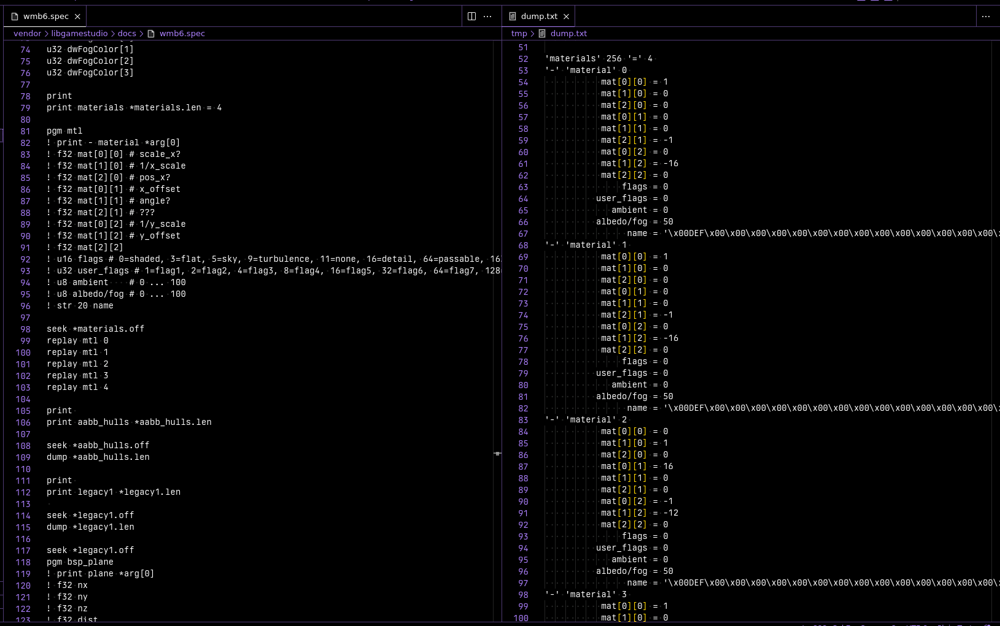

# livedecode

Decompile binary data on the fly quicker.

## Usage

```sh-session
[user@host project]$ livedecode example/png.spec example/example.png
```

The tool is meant to be run live while typing on a spec, so one can do stuff like this:


Just run the program periodically in the background:

```sh-session
[user@host project]$ while true; do
  clear
  date
  livedecode docs/wmb6.spec data/wmb/wmb6/block.wmb > /tmp/dump.txt
  sleep 1
done
```

## Syntax

The format is a very crude line based syntax. Empty lines are ignored, everything past a `#` is a comment.
Lines are split into tokens separated by either space or tab characters.

The first token in a line determines the command or type of the line.
A line starting with `.` is a macro and is always executed. All other lines can be conditionally be executed.

If a line starts with a type, this type is decoded. If a name is given after the type, a variable is created with that name.

In a lot of places where not a name is expected, either immediate numbers can be written as decimal, hexadecimal (`0x1A`) or a
variable reference can be used (`*variable`).

Available commands are:

```rb
print …         # prints all arguments
seek <offset> … # sums up all offsets and moves the read cursor to the absolute position
move <offset> … # sums up all offsets and moves the read cursor relatively. Accepts negative numbers
tell            # prints the file cursor
tell <variable> # stores the file cursor in <variable>
dump <len>      # dumps <len> bytes
pgm <name>      # creates a new program called <name>
! …             # appends everything past the ! to the last created program
replay <pgm> …  # invokes a program named <pgm>. all arguments past that are passed as variables arg[0] to arg[n]
endian le       # changes integer endianess to little endian
endian little   # changes integer endianess to little endian
endian be       # changes integer endianess to big endian
endian big      # changes integer endianess to big endian
```

Available macros are:

```rb
.if <value>          # the code following this will be executed if <value> is not 0
.if <value> <equals> # the code following this will be executed if <value> is equals to <equals>
.else                # swaps the current execution condition
.endif               # ends a if block
.def <name> <value>  # creates a variable called <name> with the value <value>. Useful for constants or aliases
```

Available types are:

```rb
u8         #  8 bit unsigned integer
u16        # 16 bit unsigned integer
u32        # 32 bit unsigned integer
u64        # 64 bit unsigned integer
i8         #  8 bit signed integer, two's complement
i16        # 16 bit signed integer, two's complement
i32        # 32 bit signed integer, two's complement
i64        # 64 bit signed integer, two's complement
f32        # 32 bit floating point
f64        # 64 bit floating point
str  <len> # ascii string of <len> bytes, displayed as string+escapes
blob <len> # binary blob of <len> bytes, displayed as array
```

## Example

```
endian le
u32 magic
u32 type
u32 offset
u32 length

print section 1
seek *offset
dump *length

.if *type 10
  seek 0x200
  str 10 description
.endif
```

A more complete example can be found [here](example/), which will decode a good amount of a PNG file.

## Building

1. Fetch the latest zig install (tested with `0.10.0-dev.4442+ce3ffa5e1`).
2. Invoke `zig build`.
3. Install `zig-out/bin/livedecode` into your system in a way you like it.
